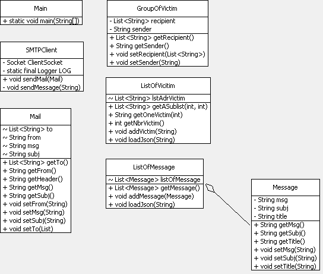

# RES_MailForger

## Description

This program is a simple SMTP client with a console interface to create some forged mails for pranking your friend.

## How to use it

Just clone the repo, go into the *release* folder with your terminal and execute the following command:

`java -jar MailForger.jar`

Don't forget to edit the server configuration in *conf.json* file.

An example of mail list file and messages list file are provided in the release folder.

### conf.json

This is the configuration file where you can set :
* the address of the SMTP server
* the port of the SMTP server
* the hostname that you want to be authentified by the SMTP server

### mail.json

This where all the email for the prank are stored.

### messages.json

This where all the messages and there subject are stored

## How it's implemented

### class diagram

### SMTPClient

This class manage all the communication between the server and your machine. When the class is instanciated, the constructor try to connect to the SMTP server. If it receive a 200 SMTP code (SMTP code to say you are well connected), then the constructor try to send a HELO command to the server. If it's ok (250 SMTP code), then you can try to send mail with the function sendMail(Mail m).

The function sendMail work like the constructor, it's try to make the different SMTP command to send a mail and if something goes wrong, a logger display it.

### Mail, ListOfVictim, ListOfMessage & GroupOfVictim

This class are just here to make things more easy to maintain & upgrade. They are just abstraction from the things that they are named after.

### Main

This the main class of the project.

## Some screenshot !

## Install a mock SMTP server for testing

Maybe you want to experiment with this tool before starting to really
send pranks mails.

To do so you can install a mock SMTP server.
In our case we will use [MailDev](https://github.com/djfarrelly/MailDev):
A simple smtp mail server built on top of NodeJS.
It provide a web interface to easily preview your email
and even relay them to a real smtp server.

### What is Mocking

Let’s try a definition:

> Service Mocking, or simulation, is the practice of creating a
> facsimile environment that works similar to the environment
> you’re facsimileing.

That’s fancy speak for saying "You build something
that works as something else".

So you should use mocks when you can’t use the real thing.

In our case we use a custom local SMTP server that will save all
the mails sent to it. In this way we can easily verify those mails
instead of flooding some email addresses during our testing.

### Install MailDev

#### Requirement

* [NodeJS](https://nodejs.org/en/download/)

#### Install

To install MailDev launch the following command in your terminal:

`npm install -g maildev`

#### Use

To run MailDev simply use the following command in your terminal:

`maildev`

If you want to be able to relay your mail to a real smtp sever you
can run it with the following parameter:

`maildev --outgoing-host smtp.domain.tld`

To see all the other parameters just use:

`maildev -h`
